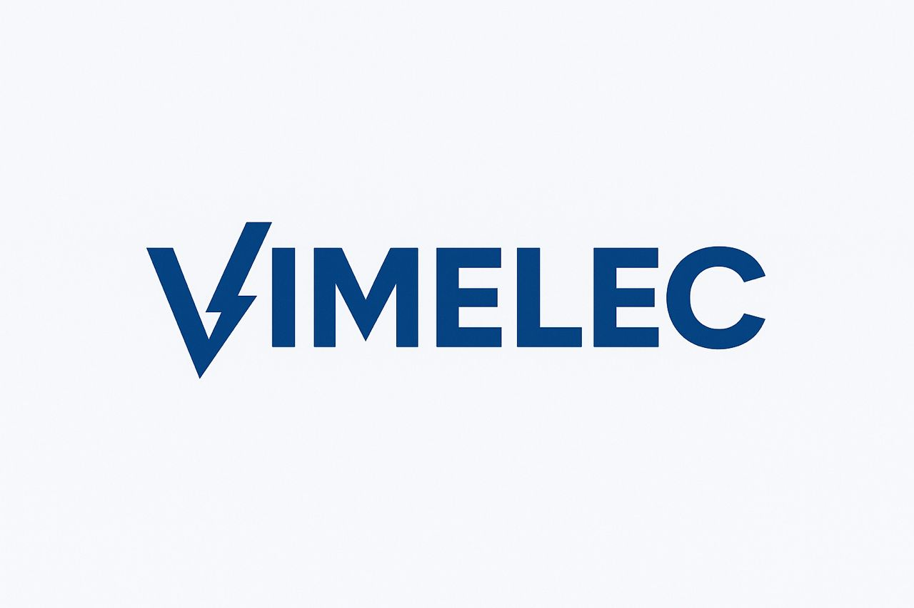

# VIMELEC — Vente, Ingénierie et Maintenance Électriques



Bienvenue sur le site officiel de **VIMELEC**, une entreprise spécialisée dans la **vente**, **l’ingénierie** et la **maintenance des équipements électriques**.
Ce projet est une application web moderne construite avec **Next.js 14**, **Tailwind CSS**, **shadcn/ui**, et **next-intl** pour la gestion multilingue.

---

## Technologies utilisées

-   **[Next.js](https://nextjs.org)** — Framework React moderne pour le rendu côté serveur (SSR) et la génération statique (SSG).
-   **[Tailwind CSS](https://tailwindcss.com)** — Framework CSS utilitaire pour un design rapide et cohérent.
-   **[shadcn/ui](https://ui.shadcn.com)** — Composants réutilisables basés sur Radix UI, élégants et accessibles.
-   **[next-intl](https://next-intl-docs.vercel.app)** — Gestion multilingue (anglais, français, chinois et italien).
-   **TypeScript** — Typage statique pour un code plus fiable et maintenable.

---

## Fonctionnalités principales

-   Interface responsive et performante
-   Gestion **multilingue** : `en`, `fr`, `zh`, `it`
-   Optimisation SEO et balises meta adaptées pour chaque langue
-   Composants UI modernes et cohérents
-   Déploiement continu sur **Vercel**

---

## 🧩 Structure du projet

```
vimelec/
│
├── app/                    # Pages et routes Next.js (App Router)
│   ├── [locale]/           # Dossiers de langues
│   ├── layout.tsx          # Layout global
│   └── page.tsx            # Page d’accueil
│
├── components/             # Composants UI réutilisables
├── lib/                    # Utilitaires et helpers
├── public/                 # Images et fichiers statiques
├── locales/                # Fichiers de traduction JSON
└── tailwind.config.js      # Configuration Tailwind CSS
```

---

## 💻 Démarrage du projet

Clone le dépôt, installe les dépendances et lance le serveur de développement :

```bash
# Installer les dépendances
npm install
# ou
yarn install
# ou
pnpm install

# Lancer le serveur de développement
npm run dev
# ou
yarn dev
# ou
pnpm dev
```

Une fois lancé, ouvre ton navigateur à [http://localhost:3000](http://localhost:3000)
Le site se mettra à jour automatiquement.

---

## 🌐 Déploiement

Le site est hébergé sur **[Vercel](https://vercel.com)** — la plateforme officielle de Next.js.

Déploiement automatique depuis la branche principale (`main`) :
[https://vimelec.vercel.app](https://vimelec.vercel.app)

Pour plus de détails :
👉 [Documentation officielle du déploiement Next.js](https://nextjs.org/docs/app/building-your-application/deploying)

---

## 📘 Ressources utiles

-   [Documentation Next.js](https://nextjs.org/docs)
-   [Guide Tailwind CSS](https://tailwindcss.com/docs)
-   [shadcn/ui Documentation](https://ui.shadcn.com/docs)
-   [next-intl Documentation](https://next-intl-docs.vercel.app)

---

## 🏢 À propos de VIMELEC

**VIMELEC (Vente Ingénierie et Maintenances Électriques)** est une entreprise spécialisée dans la fourniture de solutions électriques complètes :

-   Installation et maintenance des équipements
-   Études et ingénierie des réseaux électriques
-   Vente de matériel électrique professionnel

> Notre mission : fournir des solutions électriques sûres, durables et adaptées aux besoins de nos clients.
